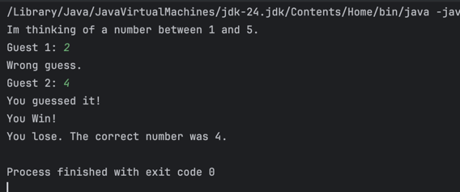
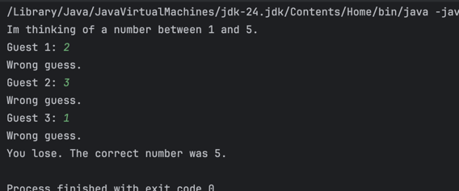

## Lab 3: Guessing Game

Create a simple number guessing game in Java. In this game:

The computer secretly picks a number between 1 and 5.

The player has 3 chances to guess the correct number.

After each guess, tell the player if they were correct or not.

If the player guesses right within 3 tries, display a "You win!" message.

If they use all 3 tries without guessing correctly, display "You lose. The correct number was X."

## Sample Output
If player wins

if player fails.

